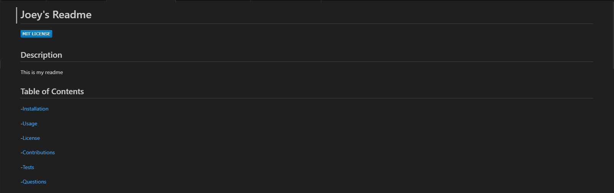

# Creating a Readme

  ## Description
  This is a read me generator that creates a read me. 
  The read me is created by asking the user questions, and then the user answers to those questions are used to fill in the read me.

  

  ## Installation
  
    You can go to either the repo and download it using the command "git clone git@github.com:Rockojoe2/creating-a-readme.git" 

  ## License
  MIT License

  ## Credits
  UTA class repo folder

  